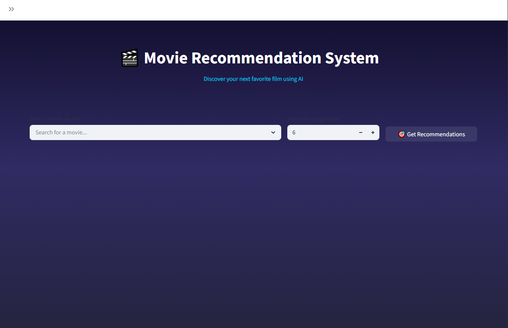
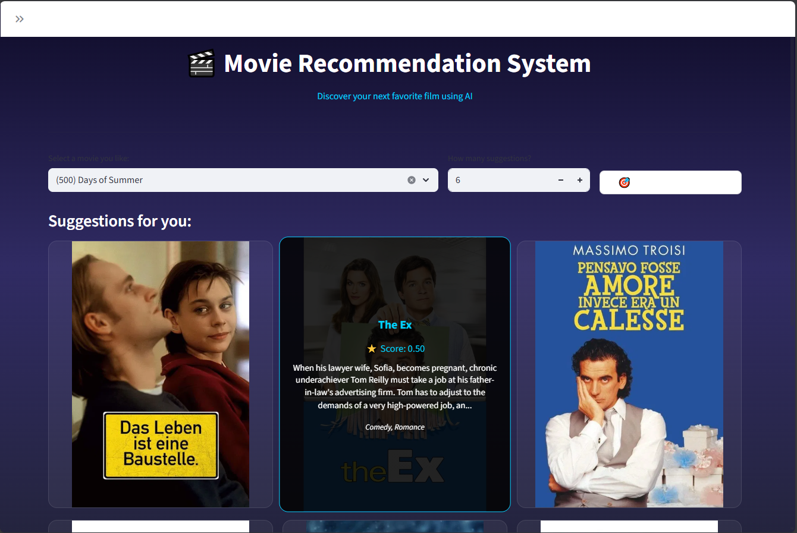
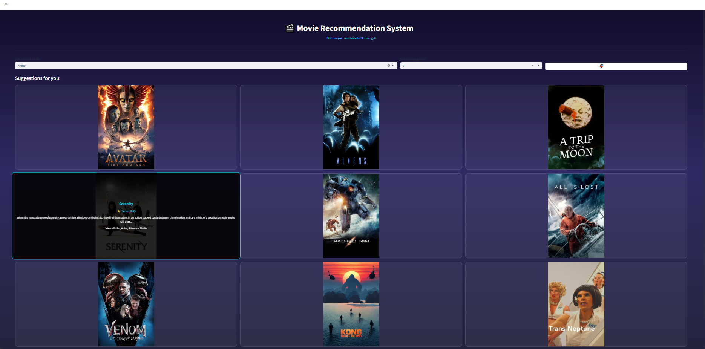

# 🎬 Movie Recommendation System (NLP)

A **content-based movie recommendation system** built using **Natural Language Processing (NLP)** techniques.  
The system recommends similar movies based on semantic and textual similarity after the user inputs a movie title.

Movie data is **scraped from TMDB (The Movie Database)** and processed to generate accurate recommendations.

---

## 🚀 How It Works

The recommendation engine computes a **weighted similarity score** between movies using the following components:

| Feature        | Technique Used | Weight |
|---------------|--------------|--------|
| Description   | BERT (SBERT) embeddings | 0.7 |
| Genres        | TF-IDF         | 0.2 |
| Cast          | TF-IDF         | 0.1 |

The final score prioritizes **semantic meaning** while still capturing categorical similarities.

---

## 🧠 NLP & ML Techniques

- BERT for semantic similarity
- TF-IDF Vectorization for genres and cast
- Cosine Similarity for similarity measurement
- Weighted feature fusion for improved relevance

---

## 🛠 Tech Stack

- Python
- Pandas, NumPy
- NLTK
- Sentence-Transformers
- Streamlit

---

## 📊 Data Source

- Movie data scraped from **TMDB**
- Includes:
  - Movie titles
  - Descriptions (overview)
  - Genres
  - Cast information

---

## ✨ Features

- Content-based movie recommendations
- Context-aware similarity using weighted NLP features
- Simple and intuitive UI
- Fast similarity computation
- Easily extensible architecture

---


---

## ▶️ How to Run the Project

1. Clone the repository:
```bash
git clone https://github.com/Abdalla1908/movie-recommender-system.git
pip install -r requirements.txt
streamlit run main.py
```

## 🖼 Screenshots






